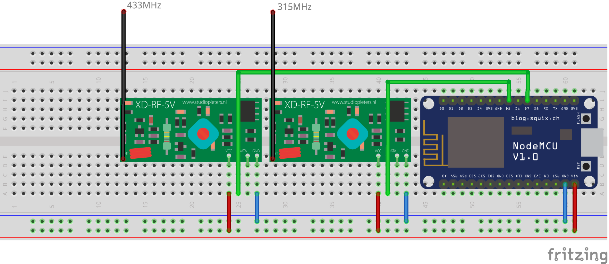

RCSwitch
========

This is a fork of [RCSwitch by Ernest314](https://github.com/Ernest314/RCSwitch) but for standalone usage without Spark.

For more information please go to the source repository. This repository only provides a multiple frequency receiving example using multiple modules (ReceiveDemo_Advanced_Multiple.ino). 

Wiring diagram can be checked out below:

> Credit:
> [squix78 for NodeMCU](https://github.com/squix78/esp8266-fritzing-parts),
> [AchimPieters for RF module](https://github.com/AchimPieters/Fritzing-Custom-Parts)